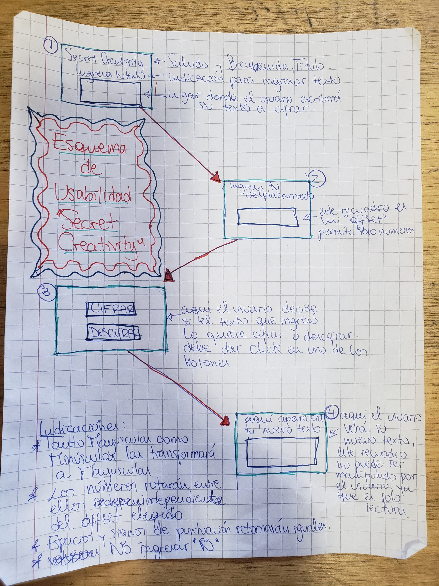

PROYECTO CIFRADO CESAR
READ.ME

“Secret
 Creativity”

Camila Guerrero Verdejo

Laboratoria 7° generación

Diciembre 2018, santiago

Introducción

  El presente documento tiene el objetivo de documentar la creación y desarrollo del proyecto “Secret Creativity”, explicando la forma en que este trabajo se relaciona con el usuario final, detallando  todos los aspectos que hacen referencia a la experiencia de usuario, así como los aspectos técnicos que permitieron construir este producto. 

Introduction

This document has the objective of documenting the creation and development of the "Secret Creativity" project, explaining how this work is related with the final user, detailing all the aspects that refer to the user's experience, as well as the technical aspects that were allowed to build this product.

Design Thinking

El proceso de Diseño

1) Descubrimiento e Investigación

 Al momento en que se nos presenta esl proyecto a realizar , la primera pregunta que me viene a la mente es ¿Quién necesitaría ocultar un mensaje o un texto? Siendo que con internet podemos tener muchísimas aplicaciones con contraseñas para mantenernos “seguros en la red”… en la época de la cuarta revolución industrial, donde el boom digital es cada día mas fuerte, al momento de mirar a mis compañeras con maravillosas ideas para su trabajo -las cuales consideré también muy sólidas-, me dije a mi misma “me encantaría tener alguna idea tan ingeniosa la cual no fuera replicada por nadie más”. 
¡Ingenio! ¿que es el ingenio? Según el drae, ingenio es la “facultad del ser humano para discurrir con prontitud y facilidad” así como también ingenio es  “intuición, entendimiento, facultades poéticas y creadoras”
(fuente: https://dle.rae.es/?id=LaAQJoU), es decir, el ingenio es la facultad del ser humano para crear e innovar, y este se encuentra intrínsecamente ligado con la creatividad, pero ¿que ocurre cuando al tener una idea ingeniosa, creativa, esta nos es “robada”? , esta acción nos puede dejar completamente devastados psicológicamente dependiendo tanto de la apreciación emocional que teníamos hacia ella, como el nivel de desarrollo que tenía nuestra idea (muchas veces esta se podía encontrar pronta a la ejecución al momento de ver que ya no nos pertenecía, sino que otra persona se la había “apropiado” de ella)

2) Síntesis y Definición

En estos dias el valor que se le da al pensamiento creativo es inconmesurable, pues una idea ingeniosa hoy puede ser un producto invaluable el dia de mañana, por lo tanto, si el problema que queremos solucionar es evitar que nuestras ideas creativas nos sean robadas, ¿en que debe consistir la solución a este problema? La manera en que quisiera solucionarlo es que quienes sienten que tienen un pensamiento creativo en su mente, lo puedan comenzar a desarrollar (al menos de manera escrita) sin que nadie pueda arrebatárselo, para esto volvemos a la pregunta del inicio ¿quién necesitaría esconder un mensaje o un texto? Al responder esta pregunta defino mi público objetivo; mi usuario final.
El usuario final de esta aplicación es aquella persona que se siente creativa, que constantemente piensa en ideas innovadoras las cuales le gustaría en algún momento llevar a cabo, pero basta de generalidades, comencemos a definir:
a) el primer requisito es que la persona logre escribir en el, por esto la edad mínima ha sido definida desde los 7 años en adelante, bajo la supervisión de un adulto responsable.
b) lamentablemente, este proyecto, al no tener integrado un software de lector de pantalla, no es apto para personas con discapacidad visual.
c) este trabajo los pueden utilizar tanto mujeres como hombres, sin importar la edad, solo importa que sepan escribir, por lo que tampoco está pensado en personas analfabetas.
d) lo más importante de los usuarios es que logren desarrollar de la mejor manera su pensamiento creativo de la mano de esta aplicación.

3) Ideación

Junto con idear el el producto, planifico la manera en que lo llevaré a cabo, ya sea a través de los tiempos y las tareas que he de definir en https://trello.com/b/IudGRWNx/caesar-cipher, ideo de que manera quiero mi interfaz para luego llegar a la idea final y que creo es mas convincente y atractiva para el usuario final.
Lo principal de la interfaz es que la paleta de colores en que nos basaremos debe fomentar la creatividad, que sea llamativo a la vista, pero que también produzca un efecto a nivel neuronal. Junto con esto busco que el lugar donde se ingresa el texto y también el que imprime el nuevo texto sea lo suficientemente grande para que la letra pueda ser legible para personas que tienen la visión con un leve deterioro
4) Prototipado
Este proceso se definió en tres partes principales
A) En la siguiente imagen aparece el prototipo que diseñé el primer dia, siendo diametralmente distinto al prototipo final, este prototipo se componía de 5 interfaces.

B) La imagen a continuación muestra mi prototipo final, el cual busca ser amigable con el usuario y sencillo de comprender.

C) A continuación se explica de manera detallada cómo el usuario debe interactuar con la pantalla 

5) User Testing

Historia de Usuario: yo, como persona con un grado de pensamiento creativo, se me ha ocurrido una fantástica e innovadora idea, la cual quiero desarrollar en silencio sin que nadie lo sospeche ni pueda arrebatármela, es por esto que me gustaría que existiera una aplicación donde poder guardar mi idea de la manera mas segura ¿y que mejor que un mensaje codificado, el cual podré cifrar y descifrar cuantas veces quiera y necesite?  

User Experience: Tienes una gran idea que te gustaría guardar para que no se te olvide pero que a la vez nadie pueda acceder a ella, conoces “Secret Creativity” y te gustaría comenzar a utilizarla, lo primero que haces es: 
En el lugar donde dice”Escribe tu maravillosa idea aquí” escribes esa idea que atesoras y te gustaría guardar, luego donde aparece “ingresa cuantos caracteres quieres desplazar tu texto” debes ingresar con numeros, este será tu desplazamiento (recuerda no ingresar la letra ñ), luego, si quieres cifrar tu texto, debes hacer click en cifrar, y si lo quieres descifrar, haz click en descifrar :) 

Information for Developers

Para la realización de este proyecto se utilizó JavaScript6, HTML5, CSS3, BDD.

Si desean contribuir a este proyecto deben hacer fork aquí:

Enviar Pull Request sobre el proyecto

Generar Issues.
